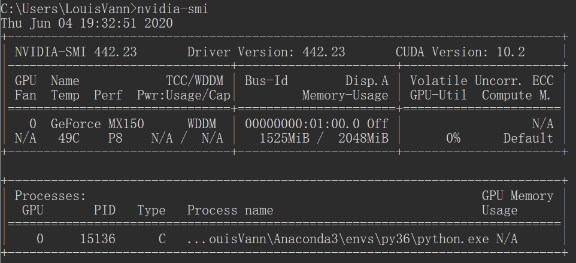

# TensorFlow-gpu 2.1.0 安装
参考文章：  
* [tf 官方文档](https://tensorflow.google.cn/install/gpu) 但好像没什么用  
* [TensorFlow1.2~2.1各个GPU版本CUDA和cuDNN对应版本整理](https://blog.csdn.net/fengdu78/article/details/104667044/)  
* [tensorflow2.0GPU版本的环境配置与安装教程](https://blog.csdn.net/wangbowj123/article/details/89381562)  
* [小米MX150+Win10+Anaconda3安装tensorflow-gpu2.1.0](https://blog.csdn.net/weixin_44318053/article/details/104964875)  

但上面的文章实际上都没派上用场。真正对我有用的是这篇：  
[win10系统极简安装Tensorflow2.1—gpu版本流程](https://blog.csdn.net/u011435933/article/details/104434104?utm_medium=distribute.pc_relevant.none-task-blog-baidujs-3)  

nvidia-smi 命令需要配置PATH环境变量，查看到我的信息如下：


cuda 和 cudnn其实都没有安装。命令 `conda install tensorflow-gpu==2.1.0` 会自动安装这些依赖包。我实际 install 的时候，下载了 300 多 MB 的包，并自动进行了安装，包括 tensorflow-gpu tensorboard cudnn-7.6.5 等等。

下面是一些测试的打印信息：
```
(py36) C:\Users\LouisVann>python
Python 3.6.10 |Anaconda, Inc.| (default, Jan  7 2020, 15:18:16) [MSC v.1916 64 bit (AMD64)] on win32
Type "help", "copyright", "credits" or "license" for more information.
>>> import tensorflow as tf
2020-06-04 19:21:27.811127: I tensorflow/stream_executor/platform/default/dso_loader.cc:44] Successfully opened dynamic library cudart64_101.dll
>>> tf.test.is_gpu_available()
WARNING:tensorflow:From <stdin>:1: is_gpu_available (from tensorflow.python.framework.test_util) is deprecated and will be removed in a future version.
Instructions for updating:
Use `tf.config.list_physical_devices('GPU')` instead.
2020-06-04 19:21:45.552388: I tensorflow/core/platform/cpu_feature_guard.cc:142] Your CPU supports instructions that this TensorFlow binary was not compiled to use: AVX AVX2
2020-06-04 19:21:45.558662: I tensorflow/stream_executor/platform/default/dso_loader.cc:44] Successfully opened dynamic library nvcuda.dll
2020-06-04 19:21:46.215291: I tensorflow/core/common_runtime/gpu/gpu_device.cc:1555] Found device 0 with properties:
pciBusID: 0000:01:00.0 name: GeForce MX150 computeCapability: 6.1
coreClock: 1.0375GHz coreCount: 3 deviceMemorySize: 2.00GiB deviceMemoryBandwidth: 37.33GiB/s
2020-06-04 19:21:46.222341: I tensorflow/stream_executor/platform/default/dso_loader.cc:44] Successfully opened dynamic library cudart64_101.dll
2020-06-04 19:21:46.259011: I tensorflow/stream_executor/platform/default/dso_loader.cc:44] Successfully opened dynamic library cublas64_10.dll
2020-06-04 19:21:46.314738: I tensorflow/stream_executor/platform/default/dso_loader.cc:44] Successfully opened dynamic library cufft64_10.dll
2020-06-04 19:21:46.325698: I tensorflow/stream_executor/platform/default/dso_loader.cc:44] Successfully opened dynamic library curand64_10.dll
2020-06-04 19:21:46.366588: I tensorflow/stream_executor/platform/default/dso_loader.cc:44] Successfully opened dynamic library cusolver64_10.dll
2020-06-04 19:21:46.387640: I tensorflow/stream_executor/platform/default/dso_loader.cc:44] Successfully opened dynamic library cusparse64_10.dll
2020-06-04 19:21:46.402434: I tensorflow/stream_executor/platform/default/dso_loader.cc:44] Successfully opened dynamic library cudnn64_7.dll
2020-06-04 19:21:46.407067: I tensorflow/core/common_runtime/gpu/gpu_device.cc:1697] Adding visible gpu devices: 0
2020-06-04 19:21:47.552626: I tensorflow/core/common_runtime/gpu/gpu_device.cc:1096] Device interconnect StreamExecutor with strength 1 edge matrix:
2020-06-04 19:21:47.556591: I tensorflow/core/common_runtime/gpu/gpu_device.cc:1102]      0
2020-06-04 19:21:47.559140: I tensorflow/core/common_runtime/gpu/gpu_device.cc:1115] 0:   N
2020-06-04 19:21:47.563887: I tensorflow/core/common_runtime/gpu/gpu_device.cc:1241] Created TensorFlow device (/device:GPU:0 with 1350 MB memory) -> physical GPU (device: 0, name: GeForce MX150, pci bus id: 0000:01:00.0, compute capability: 6.1)
True
```

很惊喜的发现 Geforce MX150 的算力是 6.1 有木有！

然后 tf-2.0 是可以向前兼容 tf-1.x 的，只需要添加如下代码段：
```python
import tensorflow.compat.v1 as tf
tf.disable_v2_behavior()
```
