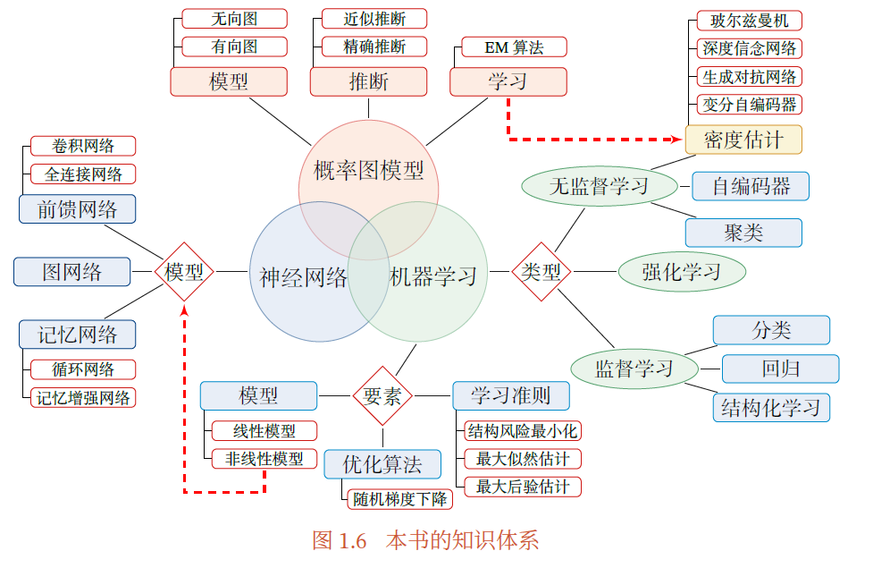

# 《神经网络与深度学习》 学习笔记
## nndl ch01 绪论
人工智能流派大致分为：  
* 符号主义：信息通过符号表示，并通过显式的规则来操作
* 连接主义：大量简单的信息处理单元组成的互联网络

机器学习中的两种特征表示方式：
* 局部表示（离散表示、符号表示）：解释性好，数据稀疏，如 one-hot
* 分布式表示（分散式表示）：表示能力强，如 RGB值  

**嵌入**通常指将一个度量空间中的一些对象映射到另一个低维的度量空间中（从局部表示，到分布式表示）  

深度学习中需要解决的关键问题的 **贡献度分配问题（CAP）**，即一个系统中不同的 **组件（component）** 或其参数对最终系统输出结果的贡献或影响。  
* 端到端学习：指在学习过程中，不进行分模块或分阶段训练，直接优化任务的总体目标  

> 斯坦福大学的CS231n 和CS224n 是两门非常好的深度学习入门课程，分别从计算机视觉和自然语言处理两个角度来讲授深度学习的基础知识和最新进展．  
1 http://cs231n.stanford.edu  
2 http://web.stanford.edu/class/cs224n/

全书知识体系如下：  
